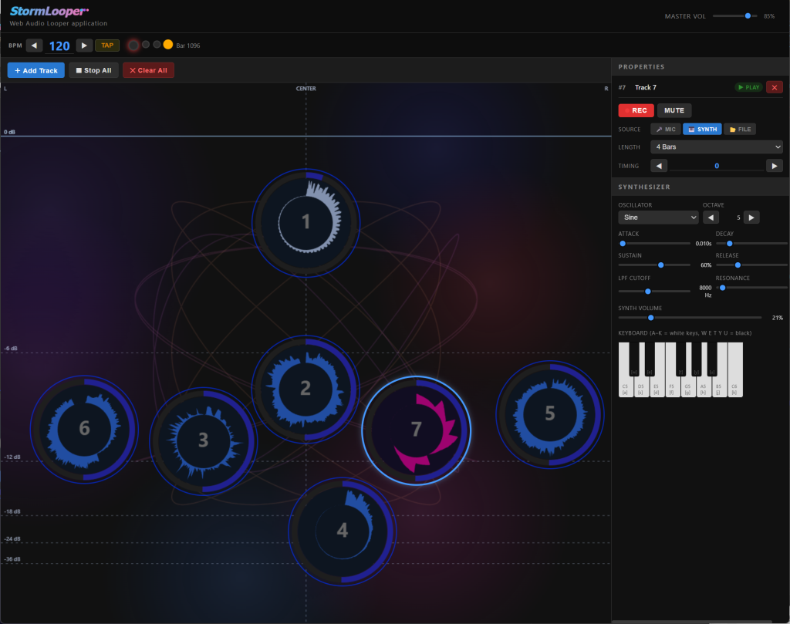

# StormLooper

A browser-based looper application built with vanilla JavaScript and the Web Audio API. No build step, no dependencies.



## Features

- **Unlimited loop tracks** — add as many tracks as you need
- **Three input sources per track**
  - 🎤 **MIC** — record from any connected microphone; supports device selection when multiple inputs are available
  - 🎹 **SYNTH** — record the built-in synthesizer while you play
  - 📂 **FILE** — load any audio file (WAV, MP3, OGG, …)
- **BPM clock** — set tempo with the +/− buttons, direct text input, or tap tempo
- **Beat-aligned recording with metronome countdown** — pressing REC waits for the next bar, plays a one-bar metronome click, then starts recording at the following bar head
- **Bar-aligned playback** — loops always start at the next bar head
- **Per-track LENGTH control** — sets the loop period independently of recording length
- **Per-track TIMING control** — shifts the playback phase within the loop period
- **Drag-to-position tracks** — drag a track circle to set volume (vertical) and stereo pan (horizontal)
- **Normalized radial waveform** — always fills the circle regardless of recording level; reflects LENGTH and TIMING visually
- **Real-time progress ring** — shows playback position within the current loop period
- **Global beat indicator** — 4-dot bar display with bar counter in the transport strip
- **Recording tail trim** — if recording ends within 0.5 beats of a bar boundary, the partial bar is discarded automatically
- **Organic VFX background** — animated blobs and Lissajous figures behind the track canvas
- **Built-in synthesizer** — sine/square/sawtooth/triangle oscillator, ADSR envelope, resonant LPF, detuned unison, on-screen keyboard with PC keyboard support

## Requirements

- A modern browser with Web Audio API and ES Modules support (Chrome 80+, Firefox 75+, Safari 14+, Edge 80+)
- A local HTTP server (ES Modules cannot be loaded from `file://`)

## Getting Started

```bash
# Clone or download the project, then serve it with any static server.

# Option A — Node.js (npx, no install required)
npx serve .

# Option B — Python
python -m http.server 8080

# Option C — VS Code
# Install the "Live Server" extension, right-click index.html → Open with Live Server
```

Open `http://localhost:3000` (or whichever port your server uses) in your browser and click **START**.

## Usage

### Recording a loop

1. Click **＋ Add Track** to create a new track.
2. Select a source: **MIC**, **SYNTH**, or **FILE**.
   - **FILE** opens a file picker immediately — the loop starts playing once the file loads.
   - **MIC** shows an input device selector when multiple microphones are available. The last selected device is remembered for subsequent tracks.
3. For MIC/SYNTH, click **REC**.
   - The transport starts if not already running.
   - The track badge shows `⏳ WAIT` while waiting for the next bar head.
   - A one-bar metronome click plays (downbeat at 1 kHz, other beats at 600 Hz).
   - Recording begins automatically at the next bar after the countdown.
4. Play your part, then click **STOP REC**. The loop starts playing from the next bar automatically.
   - If you stop within 0.5 beats of a bar boundary, the last partial bar is trimmed automatically.

### Volume and pan

Drag a track circle anywhere in the track area:

- **Vertical position** → volume (top = 0 dB, bottom = −∞). dB reference lines are drawn in the background.
- **Horizontal position** → stereo pan (left edge = hard L, right edge = hard R, center line = center).

Clicking without dragging selects the track and shows its properties.

### LENGTH

Controls the loop period independently of the recording length.

| Value | Loop period |
|-------|-------------|
| 1 Beat | 1 beat |
| 2 Beats | 2 beats |
| 1 Bar | 1 bar (4 beats) |
| 2 Bars | 2 bars |
| 4 Bars | 4 bars *(default)* |
| 8 Bars | 8 bars |
| 16 Bars | 16 bars |
| Auto | shortest bar count that fits the recording |

- If LENGTH is **shorter** than the recording, playback is cut off and the loop restarts.
- If LENGTH is **longer** than the recording, silence fills the remainder until the next loop start.

Changes take effect at the next bar boundary.

### TIMING

Shifts the playback phase within the loop period. Range: −64 to +64 beats. Default: 0.

Use the **◀ / ▶** buttons to step ±1 beat, or click the number to type a value directly.

| Value | Effect |
|-------|--------|
| `0` | Sample head plays at the loop start (bar head) |
| `+N` | Sample head plays N beats after the loop start; the buffer tail loops to fill the gap before it |
| `−N` | Playback starts N beats into the buffer; the head of the buffer is skipped |

When `|TIMING|` exceeds the loop period in beats, the value wraps with modulo arithmetic.

The radial waveform display rotates and rescales to show exactly which part of the buffer plays at each angular position.

Changes take effect at the next bar boundary.

### BPM

- Use **◀ / ▶** to step ±1 BPM (hold **Shift** for ±10).
- Click the BPM number to type a value directly; confirm with **Enter**.
- Click **TAP** repeatedly to set tempo by feel (average of the last 8 taps within 3 seconds).
- Changing BPM while loops are playing takes effect immediately with no glitches.

### Keyboard Shortcuts

Shortcuts are active when focus is not inside a text field or select element.

#### Track mute / unmute

| Key | Action |
|-----|--------|
| `1` – `9` | Toggle play/stop on tracks 1–9 |
| `0` | Toggle play/stop on track 10 |

#### Recording

| Key | Action |
|-----|--------|
| `Space` | REC toggle on the selected track |

#### BPM field (when focused)

| Key | Action |
|-----|--------|
| `↑` | BPM +1 |
| `↓` | BPM −1 |
| `Enter` | Confirm value |
| **Shift** + click ◀ | BPM −10 |
| **Shift** + click ▶ | BPM +10 |

#### Synthesizer — white keys

| Key | Note |
|-----|------|
| `A` | C |
| `S` | D |
| `D` | E |
| `F` | F |
| `G` | G |
| `H` | A |
| `J` | B |
| `K` | C (next octave) |

#### Synthesizer — black keys

| Key | Note |
|-----|------|
| `W` | C# |
| `E` | D# |
| `T` | F# |
| `Y` | G# |
| `U` | A# |

Keys can be held and released like a real keyboard — each key triggers note-on on press and note-off on release. Multiple keys can be held simultaneously.

### Synthesizer Panel

The synthesizer panel is shown only when **SYNTH** is selected as the recording source.

| Control | Range | Default |
|---------|-------|---------|
| Oscillator | sine / square / sawtooth / triangle | sine |
| Octave | 1 – 8 | 4 |
| Attack | 0.001 – 2 s | 0.01 s |
| Decay | 0.01 – 2 s | 0.15 s |
| Sustain | 0 – 100% | 60% |
| Release | 0.01 – 4 s | 0.4 s |
| LPF Cutoff | 20 – 20 000 Hz | 8 000 Hz |
| Resonance (Q) | 0.1 – 20 | 1.0 |
| Synth Volume | 0 – 100% | 50% |

## Project Structure

```
StormLooper/
├── index.html          # Minimal shell — just mounts #app and loads main.js
├── logo.svg            # Logo displayed in the header
└── js/
    ├── main.js         # Bootstrap: init overlay, AudioContext gate, wiring
    ├── styles.js       # All CSS injected as a <style> tag at runtime
    ├── AudioEngine.js  # AudioContext, master gain, dynamics compressor
    ├── Transport.js    # BPM clock, beat scheduler, bar/boundary helpers
    ├── LoopTrack.js    # Single loop slot: LoopScheduler, LENGTH/TIMING logic, waveform
    ├── Recorder.js     # Beat-aligned mic/synth recording via MediaRecorder
    ├── Metronome.js    # Audio-precise click track for recording countdown
    ├── Synth.js        # Oscillator synth: ADSR, resonant LPF, detuned unison
    └── UI.js           # Entire DOM built in JavaScript; no HTML templates
```

The UI is generated entirely in JavaScript — `index.html` contains no markup beyond the `#app` mount point.

## Browser Permissions

Microphone access is requested the first time you press **REC** with the MIC source selected. The permission prompt is shown by the browser; no data is sent anywhere.

## License

MIT
